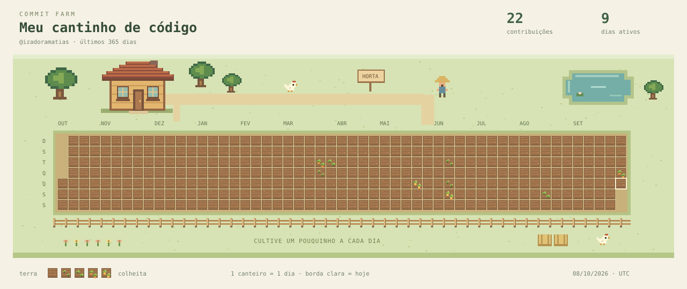

# Commit Farm 🌱

Uma fazendinha em pixel art que transforma seu calendário do GitHub em canteiros.
Arte original, inspirada no clima aconchegante de jogos de fazenda, sem assets de Stardew Valley.



**O SVG que acompanha o projeto é uma demonstração com dados fictícios.** A primeira execução configurada do workflow o substitui pelos seus dados reais.

## O que o MVP já faz

- Consulta a API GraphQL oficial do GitHub.
- Exibe 365 dias até hoje, usando datas UTC do calendário do GitHub.
- Preserva colunas semanais e linhas de domingo a sábado.
- Converte os cinco níveis oficiais de contribuição em terra, brotos, folhas e cenouras.
- Marca o dia atual com uma borda clara.
- Mostra o total de contribuições e os dias ativos da janela.
- Adiciona duas galinhas extras ao atingir 100 e 500 contribuições nessa janela.
- Atualiza a imagem de seis em seis horas e permite atualização manual.
- Mantém a última imagem se a consulta ou validação falhar.
- Usa somente Python padrão; não precisa instalar dependências.

## 1. Veja a prévia

Extraia o ZIP e abra `preview.html` no navegador, mantendo a pasta `assets` ao lado dele.
Se o navegador bloquear o SVG local, abra `assets/farm.svg` diretamente. Outra opção, na pasta do projeto:

```bash
python3 -m http.server 8000
```

Acesse http://localhost:8000/preview.html. A página não consulta o GitHub: ela apenas exibe o SVG já gerado.

## 2. Crie um repositório

Crie um repositório **público**, chamado `commit-farm`, na sua conta pessoal do GitHub. Use `main` como branch padrão. É mais simples manter a fazendinha separada do repositório do seu perfil.

Envie o CONTEÚDO da pasta `commit-farm` para a raiz do repositório, não o ZIP e não uma pasta adicional envolvendo tudo. A estrutura precisa ficar assim:

| Caminho na raiz | Finalidade |
| --- | --- |
| `.github/workflows/farm.yml` | Atualização automática |
| `scripts/generate.py` | Consulta e desenho do SVG |
| `tests/test_farm.py` | Verificações do calendário e erros de API |
| `config.json` | Username local e título |
| `assets/farm.svg` | Imagem atual |
| `preview.html` | Prévia no navegador |
| `README.md` | Este guia |

**Atenção no macOS:** `.github` é uma pasta oculta. Use `Command + Shift + .` no Finder para mostrá-la. Se ela não for enviada, não haverá automação. Se usar o upload pelo navegador e a pasta oculta não aparecer, crie o arquivo manualmente em **Add file → Create new file**, com o caminho `.github/workflows/farm.yml`, e cole o conteúdo do arquivo incluído no ZIP.

Alternativa via terminal, dentro da pasta extraída, depois de criar um repositório vazio (sem README inicial):

```bash
git init -b main
git add .
git commit -m "feat: criar minha fazendinha de contribuições"
git remote add origin https://github.com/SEU_USUARIO/commit-farm.git
git push -u origin main
```

Troque `SEU_USUARIO` pelo seu login do GitHub. O comando `git add .` inclui `.github`. Use sua autenticação usual do Git para enviar os arquivos; não coloque tokens na URL.

## 3. Escolha de quem são as contribuições

Por padrão, o workflow usa o proprietário do repositório. Em uma conta pessoal, você não precisa preencher nada.

Para escolher outro usuário: **Settings → Secrets and variables → Actions → Variables → New repository variable**.

- Nome: `FARM_USERNAME`
- Valor: o login, sem `@` e sem URL.

O título pode ser alterado em `config.json` (até 40 caracteres). A opção `username` desse arquivo é usada localmente; no Actions, `FARM_USERNAME`/proprietário do repositório têm prioridade.

## 4. Execute pela primeira vez

No repositório, abra **Actions → Atualizar fazendinha → Run workflow → Run workflow**. Se aparecer um aviso de Actions desabilitado, habilite os workflows do seu próprio repositório.

Aguarde o resultado verde. O bot fará um commit atualizando `assets/farm.svg`. Recarregue o README: o selo `DEMO` deve desaparecer e seu login deve aparecer. A execução inicial também pode começar automaticamente quando você enviar os arquivos para `main`.

O workflow pede `contents: write` apenas para salvar a imagem no próprio repositório. Para consultar contribuições públicas, ele tenta o `GITHUB_TOKEN` automático, sem configuração de secret. Se a consulta for recusada ou você quiser incluir suas contribuições privadas, use a opção a seguir.

### Token opcional para a consulta

1. Na SUA CONTA: **Settings → Developer settings → Personal access tokens → Tokens (classic) → Generate new token (classic)**.
2. Nomeie `commit-farm-read`, defina uma validade e marque **somente `read:user`**. Não é necessário conceder `repo` ou `workflow` para esta consulta de calendário.
3. Copie o token. NO REPOSITÓRIO: **Settings → Secrets and variables → Actions → Secrets → New repository secret**.
4. Nome: **`GH_READ_TOKEN`**. Valor: o token. Execute o workflow novamente.

O token fica no secret do Actions, nunca no código, SVG, HTML ou README. Esse token é usado somente para ler o calendário; quem envia a imagem continua sendo o token automático do workflow. Renove o secret quando o token expirar.

Contribuições privadas dependem das permissões/visibilidade do GitHub; para refletir os números do perfil, ative também **Contribution settings → Private contributions** no seu perfil. A imagem publica datas e contagens que a API retorna, inclusive privadas quando disponíveis. Não publica nomes de repositórios nem código. Se não quiser tornar essas contagens públicas, não use o token opcional para elas.

## 5. Mostre a fazendinha no perfil

No README do repositório especial do seu perfil (`SEU_USUARIO/SEU_USUARIO`), adicione:

```markdown
### Minha fazendinha de contribuições 🌱


```

Troque `SEU_USUARIO` nas duas posições. Se escolheu outro nome de repositório ou branch, ajuste a URL. O repositório da imagem precisa ser público para que todos possam vê-la.

Se ainda não tem README de perfil: crie um repositório público cujo nome seja exatamente seu login e adicione um `README.md`. Não substitua um README existente; acrescente a imagem ao conteúdo atual.

## Como funciona a atualização

O workflow consulta o calendário inteiro a cada seis horas, no minuto 23 (UTC). Assim, ele acompanha contribuições em diferentes repositórios da conta, dentro da visibilidade autorizada. Não é um gatilho global instantâneo de cada commit. Também é possível executar manualmente a qualquer momento.

Contribuições incluem as atividades contabilizadas pelo GitHub, não apenas commits. Os cinco estágios usam `contributionLevel`, então os limites de cada estágio são relativos à atividade da conta, não valores fixos inventados pelo projeto.

O desenho é recalculado a partir do calendário; não mantém um banco de dados. Um dia sem atividade vira terra vazia, sem destruir os anteriores. Conforme os dias saem da janela de 365 dias, desaparecem do desenho. As galinhas extras dependem do total dessa janela, não são conquistas permanentes. O MVP ainda não tem animais andando, estações, personalização de sprites ou jogo interativo.

## Executar localmente

Python 3.10 ou superior. Para experimentar sem token e sem internet:

```bash
python3 scripts/generate.py --demo
```

Para reproduzir a prévia entregue:

```bash
python3 scripts/generate.py --demo --date 2026-10-07
```

Para dados reais, preencha `username` em `config.json` e forneça o token via variável de ambiente. No Terminal do macOS (zsh), você pode lê-lo sem exibi-lo e sem escrevê-lo no histórico:

```zsh
read -s 'GH_TOKEN?Token de leitura do GitHub: '
echo
export GH_TOKEN
python3 scripts/generate.py
unset GH_TOKEN
```

Verificações:

```bash
python3 -m unittest discover -s tests -v
```

## Se algo não funcionar

| Sintoma | Como resolver |
| --- | --- |
| Não existe o workflow em Actions | Verifique `.github/workflows/farm.yml` na raiz e na branch padrão. |
| Erro 401/403 ou consulta GraphQL recusada | Configure/renove `GH_READ_TOKEN` com `read:user`; confira também restrições da organização e limite da API. |
| Usuário não encontrado | Verifique `FARM_USERNAME`; use login, não nome de exibição. |
| Erro ao fazer push | Verifique regras de proteção da branch e permissões do Actions. Este MVP funciona mais facilmente em repositório pessoal dedicado, sem bloqueio de commits do bot. Não desative proteções de outros projetos. |
| Imagem ainda mostra DEMO | Veja o log da primeira execução e confira se o commit com `assets/farm.svg` foi salvo. |
| A imagem no perfil está antiga | Confira o SVG no repositório; o cache das imagens do GitHub pode demorar a atualizar. |
| Um commit não apareceu | O próprio GitHub aplica critérios e pode levar até 24 horas para atualizar o calendário. |
| Agendamento parou | GitHub pode desabilitar workflows agendados em repositórios públicos sem atividade por 60 dias. Reative em Actions. |
| Execução agendada atrasou | Horários do Actions não são garantidos. Use Run workflow se precisar atualizar antes. |

## Validação e limites desta entrega

O gerador foi validado offline com dados fictícios, resposta simulada da API, calendário bissexto, virada de ano, zero atividade, XML válido e preservação da imagem em erro. Não foi feita uma execução autenticada na sua conta nem um deploy no GitHub; isso acontece quando você configurar o repositório e executar Actions.

`preview.html` é apenas uma página local de visualização. O produto deste MVP é o SVG embutível no perfil; hospedagem de um site público não está configurada.

## Referências oficiais

- [Calendário de contribuições na API GraphQL](https://docs.github.com/en/graphql/reference/users#contributioncalendar)
- [Coleção de contribuições e read:user](https://docs.github.com/en/graphql/reference/users#contributionscollection)
- [Eventos e agendamento do Actions](https://docs.github.com/en/actions/reference/workflows-and-actions/events-that-trigger-workflows#schedule)
- [Critérios para contribuições no perfil](https://docs.github.com/en/account-and-profile/reference/profile-contributions-reference)
- [Contribuições que não apareceram](https://docs.github.com/en/account-and-profile/how-tos/contribution-settings/troubleshooting-missing-contributions)

Código e arte deste projeto: licença MIT. Sem vínculo com Stardew Valley ou GitHub.
